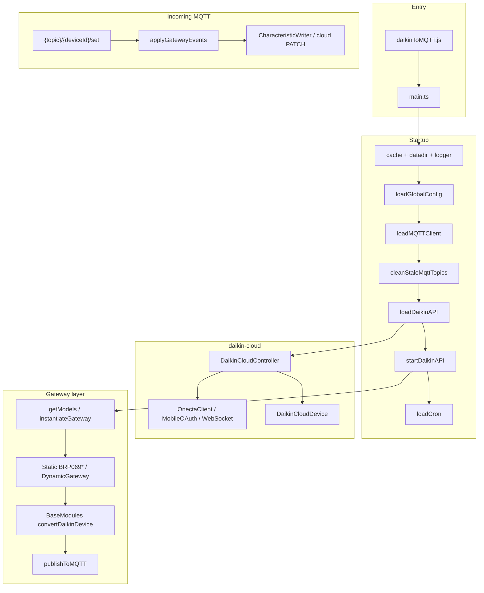

# Architecture reference

High-level map of **daikin2mqtt**. For step-by-step feature workflows, see [AGENTS.md](../AGENTS.md).

## Layer diagram



## Startup sequence (`src/main.ts`)

1. `global.cache` = `createCache()`
2. `global.datadir` = `STORE_DIR` or `./config`
3. `global.logger` = `loadLogger()`
4. `loadGlobalConfig()` — reads `{datadir}/settings.yml`, runs `validateConfig()`
5. `loadMQTTClient()` — connect broker, LWT on `{topic}/system/bridge/availability`
6. `cleanStaleMqttTopics()` — remove obsolete retained topics
7. `loadDaikinAPI()` — `DaikinCloudController`, register auth/rate-limit/WS events
8. `startDaikinAPI()` — auth, load devices, subscribe MQTT `/set`, publish state + discovery
9. `loadCron()` — adaptive polling + daily energy stats cron

### Shutdown (SIGINT/SIGTERM)

`beginShutdown` → clear post-action timers / pending commands / gateway cache → pause polling → stop cron → disable WebSocket → disconnect MQTT → `process.exit(0)`.

## Cloud layer (`src/daikin-cloud/`)

| Module | Role |
|--------|------|
| `index.ts` | `DaikinCloudController` — device map, auth, WS, bulk refresh |
| `device.ts` | `DaikinCloudDevice` — `getData` / `setData`, firmware update |
| `onecta/oidc-client.ts` | `OnectaClient` — REST `/v1/*`, token refresh, rate-limit headers |
| `onecta/mobile-oauth.ts` | `DaikinMobileOAuth` — Onecta account auth (3000 req/day) |
| `onecta/websocket.ts` | `DaikinWebSocket` — push updates (mobile_app mode) |
| `http-transport.ts` | HTTP via Node or curl (WAF workaround) |
| `schemas.ts` | Zod validation for tokens and rate-limit status |

Auth modes: `developer_portal` (200 req/day, OIDC browser flow) or `mobile_app` (3000 req/day + WebSocket).

## Gateway layer

### Class hierarchy

```
AbstractGateway
├── BRP069A4x, BRP069B4x, BRP069C4x   (ExtendedMonoZoneClimateGateway.ts)
├── BRP069C41, BRP069C8x              (MonoZoneClimateGateway.ts)
├── BRP069A61, BRP069A62              (DualZoneHeatPumpGateway.ts)
└── BRP069A78                         (MultiZoneClimateGateway.ts)

DynamicGateway      — auto-maps API datapoints for unknown models
UnsupportedGateway  — fallback when dynamicFallback is false
SystemBridge        — daemon status (not a Daikin device)
```

### Model resolution (`src/modules/daikin.ts`)

```
detectGatewayModel(device)
  → reads gateway/modelInfo or 0/modelInfo
resolveGatewayModel(raw)          [modelResolver.ts]
  → exact match → family pattern → null
createStaticGatewayInstance(model)
  → switch/case → new BRP069*(device)
```

If no static match:
- `system.dynamicFallback !== false` → `DynamicGateway` (`supportStatus: partial`)
- else → `UnsupportedGateway` (`supportStatus: unsupported`)

Instances are cached per `deviceId` in `gatewayCache`.

### Characteristic pipeline

1. Gateway constructor registers `CharacteristicDefinition[]` via `metadataRegistry.ts`
2. `convertDaikinDevice()` (`BaseModules.ts`) reads cloud data → populates `_propertyKey` values
3. `enrichDeviceSupport()` adds `_supportStatus`, `_configCoverage`, `_debugReport`, etc.
4. `publishToMQTT()` sends JSON state; `makeDefineFile()` generates Jeedom/HA discovery

## MQTT layer

| File | Role |
|------|------|
| `mqtt.ts` | Connect, publish (retained QoS 0), delta cache, subscribe |
| `mqttLifecycle.ts` | Republish all state after reconnect |
| `converter/jeedom.ts` | `generateCMD()` — Jeedom command definitions |
| `converter/homeassistant.ts` | `generateHADiscovery()` — HA MQTT Discovery |
| `converter/logics.ts` | `makeDefineFile()` — orchestrates integration configs |

Base topic: `config.mqtt.topic` (default `daikinToMQTT`).  
System bridge ID: `960adb71-4632-4f53-bf47-8ffa5abd7581` (`instanceId.ts`).

Full topic/payload contract: [workflows/mqtt-contract.md](workflows/mqtt-contract.md).

## Source file map (`src/`)

### Root

| File | Role |
|------|------|
| `main.ts` | Entry point, init + shutdown |
| `global.d.ts` | Global types: `logger`, `config`, `mqttClient`, `cache`, `datadir`, `daikinClient` |

### `types/`

| File | Role |
|------|------|
| `Daikin2MQTT.d.ts` | Config interfaces, gateway union, support metadata types |
| `index.ts` | Re-export |

### `modules/` (application core)

| File | Role |
|------|------|
| `index.ts` | Barrel exports |
| `config.ts` | Load and assign `global.config` from YAML |
| `configValidator.ts` | Imperative config validation, `ConfigValidationError` |
| `daikin.ts` | Cloud orchestration, gateway factory, MQTT subscribe, publish loop |
| `mqtt.ts` | MQTT client lifecycle and publish helpers |
| `mqttLifecycle.ts` | Reconnect republish handler |
| `logger.ts` | Winston setup (files + conditional console) |
| `cron.ts` | Adaptive day/night polling, energy stats cron |
| `rateLimiter.ts` | Retry queue, exponential backoff |
| `requestBudget.ts` | Daily API quota tracking |
| `actionRefresh.ts` | Post-action refresh modes 1/2/3 |
| `writeQueue.ts` | Per-device PATCH serialization |
| `wsUpdateMapper.ts` | Merge WebSocket pushes into device cache |
| `decorator.ts` | Reflect decorators (legacy, used by SystemBridge) |
| `instanceId.ts` | Fixed system bridge UUID |
| `constants.ts` | `APP_VERSION`, cache TTLs |
| `paths.ts` | Data path helpers, `newConfig/` dir |
| `tokenPaths.ts` | Token file path by auth mode |
| `errorHandler.ts` | Typed errors, HTTP error categorization |
| `shutdown.ts` | Global shutdown flag |

### `modules/gateway/`

| File | Role |
|------|------|
| `index.ts` | Barrel — all gateways + audit + catalog |
| `AbstractGateway.ts` | Base class, characteristic registration |
| `DynamicGateway.ts` | Auto-mapping for unknown models |
| `UnsupportedGateway.ts` | Minimal metadata for unsupported models |
| `SystemBridge.ts` | Daemon status bridge |
| `BaseModules.ts` | `convertDaikinDevice`, `eventValue`, value converters |
| `metadataRegistry.ts` | Reflect metadata for characteristics |
| `modelResolver.ts` | `resolveGatewayModel()` — exact + family patterns |
| `typeConstants.ts` | `typeEnum`, `converterEnum`, `consumptionEnum` |
| `CharacteristicWriter.ts` | Apply MQTT commands, special actions |
| `ScheduleManager.ts` | Schedule and away preset helpers |
| `supportMetadata.ts` | Support status, debug report, redaction |
| `apiDiscovery.ts` | `discoverApiDatapoints()` — recursive API walk |
| `apiCoverageAudit.ts` | Compare API vs static mapping coverage |
| `Anonymise.ts` | Anonymized device dump for new models |
| `ExtendedMonoZoneClimateGateway.ts` | BRP069A4x, BRP069B4x, BRP069C4x |
| `MonoZoneClimateGateway.ts` | BRP069C41, BRP069C8x |
| `DualZoneHeatPumpGateway.ts` | BRP069A61, BRP069A62 |
| `MultiZoneClimateGateway.ts` | BRP069A78 |
| `BRP069*.ts` | Re-export shims for each model family |
| `characteristics/catalog.ts` | Reusable characteristic packs and helpers |

### `modules/converter/`

| File | Role |
|------|------|
| `index.ts` | Barrel |
| `jeedom.ts` | Jeedom CMD generation |
| `homeassistant.ts` | HA discovery configs |
| `logics.ts` | Integration config orchestration |

### `daikin-cloud/` (vendored — edit only when necessary)

See cloud layer table above. Includes `onecta/`, `cert/`, `schemas.ts`, `token-storage.ts`.

## Extension points

| Goal | Touch these |
|------|-------------|
| New datapoint | `catalog.ts` → gateway → `apiCoverageAudit.test.js` |
| New model | `modelResolver.ts` → gateway class → `createStaticGatewayInstance` → tests |
| New config key | `settings-default.yml` → types → `configValidator.ts` → VALIDATION_ERRORS docs |
| New MQTT command | `CharacteristicWriter.ts` + document in mqtt-contract |
| New integration field | `converter/*.ts` (respect existing logicalID conventions) |
