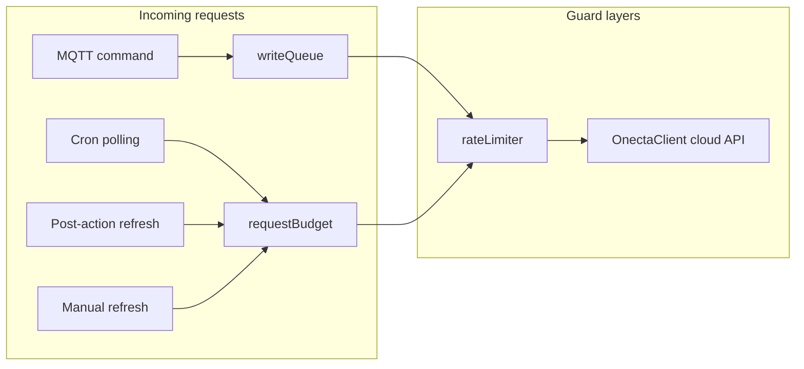

# Workflow: API quota and rate limiting

Daikin Onecta Cloud enforces daily request quotas. daikintomqtt has multiple layers to stay within limits. **Do not add code that bypasses these layers.**

## Daily quotas

| Auth mode | Daily limit | WebSocket |
|-----------|-------------|-----------|
| `developer_portal` | 200 req/day | No |
| `mobile_app` | 3000 req/day | Yes (reduces polling need) |

Configured in `settings.yml` → `daikin.authMode`.

## Module responsibilities



| Module | File | Role |
|--------|------|------|
| Rate limiter | `rateLimiter.ts` | Retry with exponential backoff, operation queue, respects rate-limit headers |
| Request budget | `requestBudget.ts` | Daily quota tracking, `canRefresh()`, polling multiplier |
| Cron / polling | `cron.ts` | Adaptive day/night intervals, pauses during post-action debounce |
| Action refresh | `actionRefresh.ts` | Post-action cloud GET (modes 1/2/3, strategies) |
| Write queue | `writeQueue.ts` | Serializes PATCH requests per deviceId |
| WS mapper | `wsUpdateMapper.ts` | Applies push updates, can skip redundant post-action GET |

## Config knobs (quota-related)

| Key | Default | Effect |
|-----|---------|--------|
| `system.polling.dayInterval` | 15 min | Day polling interval |
| `system.polling.nightInterval` | 30 min | Night polling interval |
| `system.actionRefreshMode` | 3 | 1=deferred GET, 2=optimistic only, 3=hybrid |
| `system.actionRefreshDelaySeconds` | 60 | Delay before post-action GET |
| `system.actionRefreshStrategy` | `merge_with_poll` | `timer` / `merge_with_poll` / `disabled` |
| `system.mergeWithPollWindowMinutes` | 5 | Merge post-action GET with upcoming poll |
| `system.commandCoalesceMs` | 400 | Merge rapid MQTT commands per device |
| `daikin.enableWebSocket` | true | Real-time push (mobile_app only) |

See [add-config-option.md](add-config-option.md) if adding new quota-related settings.

## How writes work (correct path)

```
MQTT /set → queueDeviceCommand (coalesce) → applyGatewayEvents
  → CharacteristicWriter → enqueueWriteForDevice(deviceId, fn)
    → rateLimiter.executeWithRetry → device.setData (PATCH)
      → optimistic MQTT publish → schedulePostActionRefresh (if mode 1 or 3)
```

**Always route cloud writes through `enqueueWriteForDevice`.** It prevents concurrent PATCH collisions on the same device.

## How reads work (correct path)

```
Cron tick → canRefresh()? → rateLimiter → updateAllDeviceData / getData
Post-action → actionRefresh → canRefresh()? → single device refresh
WebSocket push → wsUpdateMapper → update cache + publish MQTT (no GET)
```

**Always check `canRefresh()` before bulk or post-action cloud GETs.**

## Pitfalls — do NOT

| Anti-pattern | Why |
|--------------|-----|
| Call `device.getData()` / `setData()` directly from gateway code | Bypasses queue, budget, and retry |
| Add polling loops in gateway constructors | Uncontrolled API usage |
| Fire multiple PATCHes without coalescing | Wastes quota, causes race conditions |
| Skip `canRefresh()` for "just this once" reads | Exhausts daily budget silently |
| Disable rate limiter retry for cloud errors | 502/503/504 are transient and expected |
| Add synchronous cloud calls in MQTT publish path | Blocks broker, multiplies latency |

## Optimizations already in place

- **WebSocket push** (mobile_app): reduces need for polling GETs
- **Polling pause** during post-action debounce window
- **merge_with_poll**: defers post-action GET if a poll is imminent
- **WS-confirmed skip**: if WebSocket confirms the change, skip post-action GET
- **Optimistic publish** (mode 2/3): update MQTT immediately, confirm later
- **Delta publish** (`publishOnDelta`): skip unchanged MQTT payloads
- **Command coalesce**: merge rapid `/set` messages per device

## When modifying quota-related code

1. Read the full call chain before adding a cloud API call
2. Ensure reads go through `canRefresh()` + `rateLimiter`
3. Ensure writes go through `enqueueWriteForDevice`
4. Test with `logLevel: debug` and watch `[requestBudget]` / `[rateLimiter]` log lines
5. Document new behavior in CHANGELOG if user-visible

## SystemBridge quota fields

The system bridge publishes quota status over MQTT (`{INSTANCE_ID}`) for Jeedom to display:
- Remaining daily requests
- Auth mode
- Rate limit headers from last response

Do not remove or rename these fields without checking daikinRCCloud consumption.
